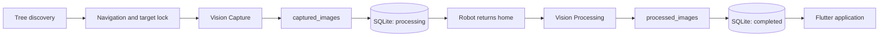

# FYP Durian Inspection System

Autonomous durian-tree inspection using **ROS 2**, **Gazebo**, RGB-D vision,
YOLO models, SQLite, and a Flutter monitoring application.

The robot discovers and visits each tree, captures synchronized RGB-D evidence,
returns home, processes the saved observations, and publishes a final disease
result for the Flutter application.

## Project tasks

- Discover durian trees and navigate to each target safely.
- Capture synchronized RGB, depth, camera calibration, and TF data.
- Detect trees and fruit and classify six durian leaf conditions.
- Store raw observations and processed images by inspection and tree ID.
- Record disease, coverage, confidence, priority, and remedy in SQLite.
- Show each tree as `processing` or `completed` in the Flutter application.

## System pipeline



### Vision Capture

`vision_node.py` performs lightweight online capture only:

```text
RGB + Depth + Camera Info
            |
            v
      RGB-D synchronization
            |
            v
  Save RGB + Depth + TF + metadata
            |
            v
captured_observations.status = CAPTURED
```

### Vision Processing

`processing_node.py` performs deferred inference after the robot returns home:

```text
Load captured observations
            |
            v
Tree YOLO -> Distance -> Target association -> Tree ROI
                                      |             |
                                      v             v
                               Fruit detection  Disease detection
                                      \             /
                                       Result aggregation
                                                |
                                                v
                                      status = completed
```

## Repository structure

```text
durian_ws/
├── models/
│   └── durian_leaf/              # Six-class leaf checkpoints (Git LFS)
│       ├── original.pt
│       ├── baseline.pt
│       └── advanced.pt
├── src/
│   ├── durian_inspection_pkg/    # ROS 2 inspection package
│   │   ├── inspection_server.py  # Navigation and inspection controller
│   │   ├── vision_node.py        # RGB-D capture pipeline
│   │   ├── processing_node.py    # Deferred inference pipeline
│   │   ├── observation_store.py  # SQLite schema and migrations
│   │   ├── bridge_node.py        # ROS-to-UI bridge
│   │   └── map_publisher.py      # Stored map publisher
│   └── durian_message/           # Custom ROS interfaces
├── durian_flutter_app/           # Flutter monitoring application
├── run.sh                        # Build and launch script
└── README.md
```

## Leaf models

| Model | Training data | Purpose |
|---|---|---|
| `original.pt` | Gazebo images | Original synthetic-domain model |
| `baseline.pt` | Balanced real and Gazebo images | Domain-gap baseline |
| `advanced.pt` | Balanced real and Gazebo images | Advanced EfficientNet experiment |

The checkpoints classify six conditions:

- Algal Spot
- Blight
- Colletotrichum / Anthracnose
- Healthy
- Phomopsis
- Rhizoctonia

## Requirements

- Ubuntu 22.04
- ROS 2 Humble
- Gazebo Classic and `gazebo_ros`
- Navigation2 and TF2
- Python 3, OpenCV, NumPy, PyTorch, and Ultralytics
- Git LFS
- Flutter SDK for the monitoring application

## Clone

Model checkpoints are stored with Git LFS.

```bash
sudo apt-get update
sudo apt-get install -y git-lfs
git lfs install

git clone https://github.com/JohnyChia/fyp.git
cd fyp
git lfs pull
```

## Build and run

```bash
chmod +x run.sh
./run.sh
```

Manual launch:

```bash
colcon build --symlink-install
source install/setup.bash
source /usr/share/gazebo/setup.sh
ros2 launch durian_inspection_pkg navigation_launch.py
```

## Runtime outputs

| Output | Description |
|---|---|
| `captured_images/<inspection>/<tree>/` | RGB, depth, and metadata evidence |
| `processed_images/<inspection>/<tree>/` | Annotated inference results |
| `durian_inspection.db` | Observations and final tree results |

Runtime outputs, build files, databases, and general model files are ignored by
Git. The following local training and dataset directories are also excluded:

```text
experiment/
hybrid_datasets/
external_datasets/
```

## Tree status

```text
processing  -- successful durable result -->  completed
```

If processing fails, the error is stored in `processing_error` and the tree
remains `processing`. It is never incorrectly labelled `completed`.

